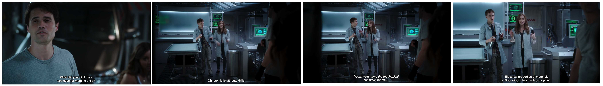

# What in the world are Morning Drills???

### The Idea
I've been tackling a memory issue. My own memory.   
I seem to learn things, practice them, document them, and then promptly forget them - or at least the details.  
I still know what the general concept is and what to search for, but the details that I would like to be able to provide from the top of my head, those are not always there. 

I've been pondering this issue for a while, whilst surviving two rounds of layoffs and trying to prepare for a variety of networking certifications. And then one day I watched Agents of S.H.I.E.L.D. 1x03 (again) when I saw this scene: 



> Ward: What did your S.O. give you guys for morning drills?  
> Simmons: Oh, atomistic attribute drills.  
> Simmons: Yeah, we’d name the mechanical, chemical, thermal...   
> Fitz: ...electrical properties of materials.

And being a huge FitzSimmons fan, I thought THIS might make it fun and be useful at the same time. So I wrote this silly little web app that asks me a handful of questions every day and validates my answers. It's kind of like Anki, but worse and better in different ways. 

## How does it work 

1. Frontend runs on React and communicates with 
2. the backend which runs on Python and Flask 
3. Data is stored in PostgreSQL and 
4. answers are validated with llama3 

It also 
* supports multiple topics by selecting different database 
* goes through the topics top to bottom and repeats them until they you fill at least 75% correctly 
* doesn't have a GUI for managing topics, questions or answers, yet, oops 

### How to set it up
* use the models and sample data in database/ to set up your DB (or make your own data)
* copy /backend/creds.env.template into /backend.env and fill in the database details 
* change frontend/App.js to point at your backend IP - yeah it's hardcoded, for now, oops 
* download all the npm packages and check the python venv
* cross your fingers

### How to Run this locally 
From the root directory: 
```
source bin/activate
cd backend 
flask --debug run (in a screen session)

cd frontend
npm start (in a screen session)
```

### How to Run this in Docker

Example docker compose:

```
version: '3.8'

services:
  backend:
    build:
      context: ./backend
      dockerfile: Dockerfile
    volumes:
      - ./backend:/app
    ports:
      - "5000:5000"
    env_file: ./backend/.env
    depends_on:
      - db

  frontend:
    build:
      context: ./frontend
      dockerfile: Dockerfile
    volumes:
      - ./frontend:/app
    ports:
      - "80:80"
    depends_on:
      - backend

  db:
    image: postgres:13
    volumes:
      - pgdata:/var/lib/postgresql/data
    environment:
      POSTGRES_USER: your_db_user
      POSTGRES_PASSWORD: your_db_password
      POSTGRES_DB: morningdrills
    ports:
      - "5432:5432"

volumes:
  pgdata:

```